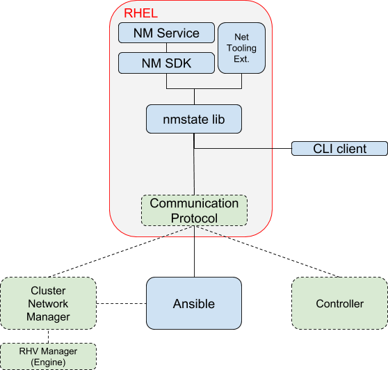
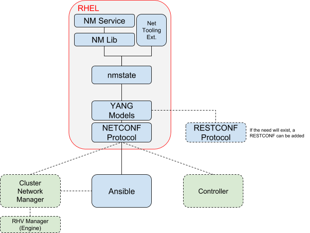

# Linux Networking API

## OVERVIEW
Networking has always been a major subsystem in the Linux ecosystem. Its
functionality is used broadly across domains, from connecting a local host to
the network up to a fully functional network device (router, switch, traffic
shaper, etc).

Linux distributions, have mainly focused on the host connectivity to the
network and less on exposing it as a network component. With the coming of the
virtualization and cloud technologies, their networking roles have extended to
include and act as virtual edge network devices. Some of these roles include
L2 bridging, traffic QoS, access rules, L3 routing and other services which
support the virtualization and cloud needs.

Unfortunately, unlike the telco industry, where many networking services have
been standardized, especially the management part, Linux distributions have no
stable agreed management interface. It seems natural to expose Linux networking
capabilities in a similar manner the telco industries does in order to make it
easier to consume and reuse.

The internal Red Hat initiative to integrate and share resources between the
existing solutions is one of the pushing forces for this paper proposal.
Looking for a management solution that can be shared and used by multiple
stakeholders is the main focus we will like to address.


## GOALS
1. Provide a stable, extensible interface to manage RHEL networking
   capabilities.
2. Support atomic and transactional operations on RHEL networking at the host
   level.
3. Support atomic and transactional operations on RHEL networking at the
   cluster level.
4. Increase RHEL networking reusage by modularizing and layering its
   management, serving different users through the same management stack.
5. Integrate RHEL networking seamlessly with existing management, controlling
   and monitoring systems.
6. Standardizing RHEL networking specifics and confirm with existing ones.


## Existing Solutions

### Cockpit
Cockpit is used as a front-end UI to various host services, including
networking. It is not exposing any API for the moment.

### D-BUS for Network Manager
NetworkManager is currently the main service on RHEL through which networking
capabilities are exposed on the local host. One option to expose it to a remote
client is through D-BUS.

### Ansible
Ansible provides multiple modules and roles to manage network devices.

Specifically for RHEL, networking is exposed through the System Roles,
which in practice exposes NetworkManager capabilities.

The availability of Ansible to expose not only RHEL, but other network device
vendors, places it in a good position for abstracting networking to upper
layers. Ansible networking has defined some cross-vendor/platform modules,
aimed to abstract differences between vendors, something that RHEL can also
take advantage of.

Currently, the major limitation seen is with the missing transaction
capabilities (mainly between modules) and the existing NM module schema which
exposes the configuration as “connection profiles” or a per device.
Both should be addressed by Ansible in future versions.

Another note worth mentioning regarding Ansible is that it does not attempt to
monitor and/or listen to events from the target devices.

### OS-NET-CONFIG
Under the OpenStack project, os-net-config is a host network configuration tool
that applies a configuration described in a YAML or JSON on the host.

It is using ifcfg, eni and iproute2 to apply the configuration on the host.

os-net-config is run with a YAML file describing the desired networking state,
and optionally a mapping file that maps MAC address or interface alias to real
NIC names.

In TripleO, os-net-config is triggered with a script that runs once on
deployment. This causes the ifcfg files to be written and the interfaces to have ifdown/ifup run on them. This is done only on initial deployment, although a separate setting can cause this to run again to modify the network configuration for upgrades or certain changes.

It covers a wide variety of networking options for Fedora-based systems, fewer
for Debian-based systems. On Fedora/CentOS/RHEL supports Interfaces, VLANs,
kernel bonds, OVS bonds, teamd bonds, Linux bridges, OVS bridges,
DPDK interfaces/bonds, SR-IOV PFs/VFs, Infiniband, Contrail Vrouters,
and Big Switch interface/bonds/bridges. In all these cases, os-net-config
writes the ifcfg files according to the config specified, and in some cases
runs scripts to help configure interfaces (such as SR-IOV PCI slot
configuration or Contrail Vrouter configuration).

It does not attempt to monitor and/or listen to events from the target devices.

Transactions are not supported.

The device types supported by os-net-config are shown in Appendix E.

### VDSM Networking

VDSM is the RHV hypervisor agent which runs on the hosts. VDSM networking
exposed a portion of the host networking capabilities in an abstract manner,
such that answers the needs of a hypervisor. It includes monitoring,
transactional operations and a well defined schema.

It uses multiple network “drivers”, including ifcfg, NetworkManager, iproute2,
netlink, ethtool and sysfs to accomplish its task.

As it is focused on hypervisor networking needs, it exposed a high level
abstraction which does not expose all host networking capabilities.
Currently it also mainly uses ifcfg and iproute2 to configure the host (and
not NM).


## Host level Requirements

### State change atomicity (Transactions)
When attempting to change the host networking state, it should either fully
succeed or fail. A fail should return the host networking state to the initial
state before the change.

Such a state change request may include multiple changes on the host,
therefore, it should be executed under a transaction. A failure in the
transaction needs to be detected and a rollback to be issued to the
pre-transaction state.

As an extension, a verification/check can be executed to confirm
connectivity/health of the host.

Optionally, extend the transaction to be extended over multiple state request
changes. Such an option separates between the state change operation and the
apply/commit operation. The model this confirms to assumes that the client
requests changes, expects them to be accumulated in a candidate state and with
a dedicated operation it atomicly applies the configuration. It is suitable
for stateless clients, which can save their configuration periodically on the
server side.

### Data model and Abstraction
The question of how a host networking state is to be represented has been
answered multiple times by multiple solutions. The challenge seems to be in
finding a representation that fits all (or most) and can be standardized.

There are several main approaches seen so far: one tries to be transparent and
relay the host configuration as represented by the local implementation,
another attempts to create a minimalistic abstraction that is flat and as
close as possible to the individual network device (in practice, listing
the devices and specifying their property). Others try to abstract the
networking options on the host for dedicated purposes or domains, hiding
low level structures.

Telco network devices (switches, routers and other services) have standardized
some of the common networking configuration properties using IETF RFC/s to
allow interoperability between vendors and the management systems. Each vendor
may then extend the configuration options through additional properties.

It is therefore proposed to attempt and follow the existing relevant
IETF RFC/s and format the networking state of a host in a similar model,
utilizing the experience of others with the experienced gained on host
specific sections.

### Monitoring & Events
In many cases, managing and controlling network nodes requires the ability to
monitor the network state, react to changes and adjust the configuration
accordingly.

As a basic example, changes in the current state of the node needs to be
reflected to the manager/controller.

RHEL, as a network node should provide such capabilities and allow a manager
to query it for operational state and telemetries. An optional event service
should allow managers to register for specific events and inform them on
state changes.

### State change effect on Data Path
Managing the host networking remotely, should add no additional disruptiveness
to the data path compared to the use of direct local tools (NM, iproute2, etc).

As an extreme example, updating an interface property which under normal
condition would not have disrupted the traffic passing through it, should
not require a full interface teardown/setup.

In this regard, the API access to the host networking should be optimize to
utilize the underly implementation providers to reduce to minimum the data path
disruption on state changes.

### Implementation Providers
NetworkManager is currently the de-facto network manager on most Linux
distributions and one of the core services on RHEL. It is the primary service
through which host networking is configured now days.

Due to the large scope of the networking domain, scenarios and configuration
details may be missing in NM, have low interest to integrate them into it or
be proprietary. For such edge cases a level of extensibility is prefered,
allowing access to modify or query entities using other tools.

### Solution Stack reusability
The solution components that are to answer RHEL networking management access
needs, should preferably be reusable and independent, allowing them to be used
in(from) other projects and replaced if required.

### Deployment
Support the ability to deploy the stack components containerized.


## SPECIFICATIONS

### Solution Overview
The proposed solution is attempting to address the requirements stated earlier
in this document.

The solution has 3 main layers:
- Backend: NetworkManager is the primary service/tool that is used to apply
the configuration on the Linux node. Other backend tools are optional, mainly
for experimental and special scenarios.
- Middleware: nmstate, bridging between the frontend and backend, interpreting
the data model and applying the configuration with the relevant NetworkManager
function/s (optionally with another backend if required).
- Frontend: Communication protocol, through which clients can communicate with
the node and control the HOST networking state.

NetworkManager backend access requires a thin layer that exposes it
programmatically. This component is referred to as “NM Lib”.

The nmstate is used as a tool to apply what was described in the data model
schema and its commands/verbs functionality requirements to the
backend (NetworkManager). In many ways, it is similar to the NetworkManager
Ansible module but is expected to be deployed on the host and used by other
clients (not only ansible).

The communication protocol specification is deferred, for now it is mentioned
in Appendix D.

### Components

#### Solution Stack Diagram


#### NetworkManager (Service & Lib)
NetworkManager is the service that controls most of the Linux host networking
options.

It can be accessed through several interfaces: nmcli, d-bus, libnm. In order
to allow access in a programmatic manner to NM, a thin NM SDK is required that
wraps the interface with the chosen language.

One implementation option can include: A Python NM SDK, wrapping access to
NM service through nmlib.

#### Network Tooling Extensions
Networking options which are not controllable by NetworkManager (even
proprietary ones) are to be handled through the tooling extensions.

Examples of its usages:
- Traffic Control related configuration (tc), like traffic shaping.
- DPDK interfaces
- Network services (DNS, DHCP server, firewall)

#### NMState
Interpreting the data model scheme and applying it using NetworkManager
interface (NM SDK) or other backends is under the nmstate responsibility.
It also needs to cover the reverse path, from the backend to the relevant data
model scheme (retrieving the host state from NM and presenting it using the
data model).

Optionally, the component should support notification forwarding from the
backend to the frontend: Enabling a manager or controller to receive
notifications when a link state changes, when an IP is updated from DHCP, when
a device is unplug/plug, etc. The manager/controller  may request a fresh host
state or take a more intelligent action as a response.

Existing similar components which could be potentially used for this purpose
are the Ansible NetworkManager module and portions of RHV host agent
(vdsm-network).

#### Ansible
Ansible represents in this context a client of RHEL, through which one can
configure its networking configuration.

Atomicity is embedded into nmstate, therefore, no special treatment is required
in that area as well.

#### Other Management and Control clients
When monitoring capabilities are required or Ansible is not the best fit for a
solution, other management and controlling clients will need to access the RHEL
node directly.

Such clients, similar to Ansible, should support the host network schema and
the communication protocol. The clients may also provide cluster level
transaction.

### Deployment
Containerizing the components for deployment is recommended.

Most networking actions require privilege access to the system. In practice,
only NetworkManager and the other backends require such access, all the rest
should be fine with unprivileged access. It is therefore suggested to use
a linker between the two domains (NM on the host root namespace and all the
other components in a container).
NMLIB or D-BUS directly can act as such a linker.

Containerizing the solution will introduce it as a service on a Linux node,
fitting well with OpenShift and K8S model.

### Configuration Examples
In this section, several configuration examples are given using Ansible,
showing how these are represented using the data model, and finally translated
to NetworkManager configuration.

See Appendix C


## MILESTONES
Phasing recommendations:
1. PoC: Implement a minimalistic nmstate, use the proposed schema and commands
   to run it all from Ansible with the unified network modules.

User Story: Setup an IPv4 address on a bond with two slaves, supporting the
concept of transaction.

2. Introduce basic configuration capabilities for bonds, bridges, vlans and
   utilize them through Ansible.
3. Complement missing RHEL networking properties, focusing on properties that
   are needed by existing projects that use RHEL networking (RHV host agent,
   Cockpit). During this phase, RHV can be used, replacing its own host agent
   networking module.


## Appendix A (Schema proposal)
The schema presented in this section is an informal version, skipping the data
types. It attempts to describe the general idea.
```
    +--rw interfaces
        +--rw interface*
           +--rw name
           +--rw description
           +--rw type (including vlan, bond, team, linux-bridge, ovs)
           +--rw state
           +--ro admin-status
           +--ro link-status (up|down)
           +--ro link-speed (base link speed for virtual interfaces)
           +--ethernet:
              +--rw auto-negotiation (yes|no)
              +--rw duplex (ro with auto-negotiation)
              +--rw speed (ro with auto-negotiation)
              +--rw flow-control (ro with auto-negotiation)
           +--rw mac-address
           +--vlan: (for vlan type)
              +--rw id
              +--rw base-iface
           +--rw mtu
           +--rw link-aggregation (appears when type is bond or team)
              +--rw mode
              +--rw slaves
                 +--rw iface-ref
              +--rw/ro options (per mode)
           +--rw bridge (appears when type is linux-bridge or OVS)
              +--rw port*
                 +--rw id/name/description
                 +--rw vlan-tags (optional, relevant for OVS)
                 +--rw iface-ref
              +--rw stp
              +--rw/ro options (specific per type)
              +--ro statistics
                 +--ro ports
                    +--ro mac-addresses
                    +--ro ...
           +--ro if-index
           +--ro phys-address
           +--ro higher-layer-if
           +--ro lower-layer-if
           +--ro statistics
              +--ro in-octets
              +--ro in-unicast-pkts
              +--ro in-broadcast-pkts
              +--ro in-multicast-pkts
              +--ro in-discards
              +--ro in-errors
              +--ro out-octets
              +--ro out-unicast-pkts
              +--ro out-broadcast-pkts
              +--ro out-multicast-pkts
              +--ro out-discards
              +--ro out-errors
       +--rw ipv4
       |  +--rw enabled
       |  +--rw forwarding
       |  +--rw dhcp
       |  +--rw address*
       |  |  +--rw ip
       |  |  +--rw (subnet) (only one of the below)
       |  |  |  +--rw prefix-length
       |  |  |  +--rw netmask
       |  |  +--ro origin
       |  +--rw neighbor*
       |     +--rw ip
       |     +--rw link-layer-address
       |     +--ro origin
       +--rw ipv6
          +--rw enabled
          +--rw forwarding
          +--rw dhcp
          +--rw autoconf
          +--rw address*
          |  +--rw ip
          |  +--rw prefix-length
          |  +--ro origin
          |  +--ro status
          +--rw neighbor*
          |  +--rw ip
          |  +--rw link-layer-address
          |  +--ro origin
          |  +--ro is-router
          |  +--ro state
          +--rw dup-addr-detect-transmits
    +--rw routing
        TBD
```


## Appendix B (Operations proposal)
This section describes the steps one needs to take to configure and examine the
host network configuration. It is presented in a programmatic manner.
- **config**: This is a dict-like (xml/json/yaml) configuration, based on
  a defined schema with writable entries.
- **config-state**: This is a dict-like (xml/json/yaml) configuration and
  state data, based on a defined schema with writable and read only entries.
  This includes the previous config and adds the state data which is read only.
- **confirm**: On any modify command with a timeout value>0, a confirm command
  is required to “approve” the change and avoid a rollback.
  It mimics a watchdog behaviour.
- **persist**: The command copies the running configuration to the startup
  configuration, allowing the changes to be persisted over reboots.
- **commit**: The command copies a candidate configuration to the running
  configuration (activating it)

**Verifying a proposed configuration (without apply):**
- verify(config)

**Modify the active configuration (non persistently) without confirmation:**
- modify_running(config, timeout=0)

**Modify the active configuration (non persistently):**
- modify_running(config, timeout=120)
- confirm()

**Modify the active configuration (persistently):**
- modify_running(config, timeout=120)
- confirm()
- persist()

**Prepare a configuration in several iterations and apply changes
(to running):**
- modify_candidate(config1, target=CANDIDATE)
- modify_candidate(config2, target=CANDIDATE)
- commit(src=CANDIDATE, timeout=120)
- confirm()
- persist()

(* Optional, not for immediate implementation.)

## Appendix C (Desired state example)

#### Ethernet interfaces with.without IP addresses
The example includes 3 ethernet interfaces, two with static IPv4 and IPv6 and
the 3rd with no IP and with the state set to down.

```
interfaces:
- name: eth0
  type: ethernet
  state: up
  ipv4:
    address:
    - ip: 192.168.122.250
      prefix-length: 24
    enabled: true
  ipv6:
    address:
    - ip: 2001:db8::1:1
      prefix-length: 64
    enabled: true
- name: eth1
  type: ethernet
  state: up
  ipv4:
    address:
    - ip: 192.168.100.192
      prefix-length: 24
    enabled: true
  ipv6:
    address:
    - ip: 2001:db8::2:1
      prefix-length: 64
    enabled: true
- name: eth2
  type: ethernet
  state: down
  ipv4:
    enabled: false
```

#### Bond
The example defines a bond with two slaves and an IPv4 static address.

The bond mode is specified to be `balance-rr` and the `miimon` options is
specified.

```
interfaces:
- name: eth2
  type: ethernet
  state: up
  ipv4:
    enabled: false
- name: eth3
  type: ethernet
  state: up
  ipv4:
    enabled: false
- name: bond99
  type: bond
  state: up
  ipv4:
    address:
    - ip: 10.10.10.10
      prefix-length: 24
    enabled: true
  link-aggregation:
    mode: balance-rr
    options:
      miimon: '140'
    slaves:
    - eth3
    - eth2

```

#### ovs-bridge
The example defines an openvswitch bridge and attaches to it the
eth3 interface (as a port).

The bridge has spanning tree (stp) enabled.

```
interfaces:
- name: eth3
  type: ethernet
  state: up
  ipv4:
    enabled: false
- name: ovs-br0
  type: ovs-bridge
  state: up
  bridge:
    options:
      fail-mode: ''
      mcast-snooping-enable: false
      rstp: false
      stp: true
    port:
    - name: eth3
      type: system
  ipv4:
    enabled: false
```


## Appendix D (NETCONF/YANG)
NETCONF/YANG is proposed for the communication protocol due to its wide use and
standardization in the TELCO industry. The standardization, the functionalities
it requires and the ability to integrate well with existing solutions (mainly
clients that already use NETCONF/YANG to manage network devices) makes it
a good fit.

### Solution Stack Diagram


### NETCONF
The Network Configuration Protocol (NETCONF) provides mechanisms to install,
manipulate, view and delete the configuration (and operational state) of
network devices. Its has been standardized by IETF and defined in RFC6241.

The protocol answers several core requirements:
- Defines an interface with base verbs for managing a network device, including
  the notion of several configuration states (startup, running, candidate) and
  operations on them.
- The protocol provides the means to define a transaction, on both a single
  node and a group of nodes.
- It is serving the YANG data model.
- RPC based.

Note: RESTCONF is another protocol that is thinner than its bigger NETCONF
brother. It lacks the transaction options, focusing on individual actions
(Like most REST based API/s expect).

### YANG
YANG is a data modeling language for the definition of data sent over the
NETCONF network configuration protocol.

It is backed by IETF standardization for both the language and several
configuration/state schemes.

IETF relevant RFC/s (reference: https://tools.ietf.org/wg/netmod)

- [IANA Interface Type YANG Module](https://tools.ietf.org/html/rfc7224):
  Defining interface types
- [A YANG Data Model for Interface Management](https://tools.ietf.org/html/rfc8343):
  Managing interfaces. Contains host interface management examples
  (defining VLAN/s, owning interfaces)
- [A YANG Data Model for IP Management](https://tools.ietf.org/html/rfc7277):
  Managing IP (including ARP)
- [A YANG Data Model for Routing Management](https://tools.ietf.org/html/rfc8022):
  Managing Routing
- [A YANG Data Model for System Management](https://tools.ietf.org/html/rfc7317):
  System identification, DNS configuration. (Date, time, user management are
  also covered, but out of scope for our needs)
- [Network Access Control List (ACL) YANG Data Model (draft)](https://www.ietf.org/id/draft-ietf-netmod-acl-model-15.txt):
  Managing firewall/netfilter capabilities


## Appendix E (OS-NET-CONFIG, Device Types)
The following list shows all of interface device types supported by
os-net-config.  The details for all device types, including additional
parameters, can be seen in the schema here: 

https://github.com/openstack/os-net-config/blob/master/os_net_config/schema.yaml

DEVICE TYPES
=============
- Interface*
- Vlan*
- Linux_bridge*
- Linux_bond*
- Linux_team*
- Infiniband_interface*
- OVS_bridge
- OVS_user_bridge
- OVS_bond
- OVS_patch_port
- OVS_tunnel
- OVS_dpdk_bond
- OVS_dpdk_port

- IVS_bridge
- IVS_interface
- NFVswitch_bridge
- NFVswitch_internal

- VPP_interface
- VPP_bond
- Contrail_vrouter
- Contrail_vrouter_dpdk
- SRIOV_pf
- SRIOV_vf

\* Supported by NetworkManager init-scripts in RHEL 7.5

For some of these interface types, os-net-config will configure both an ifcfg
file and other specific configuration files. For instance, for SR-IOV
configuration we configure an ifcfg file, a file named
/var/lib/os-net-config/sriov_pf.yaml, and a systemd service which starts
the SR-IOV virtual interfaces attached to the physical interface.
For other interface types, such as Contrail Vrouter, we configure only
an ifcfg file, but the ifup script is provided by the 3rd-party RPM currently.

Contrail ifcfg file:
- DEVICE=vhost0
- HOTPLUG=no
- ONBOOT=yes
- NM_CONTROLLED=no
- PEERDNS=no
- BOOTPROTO=static
- IPADDR=10.0.0.30
- NETMASK=255.255.255.0
- DEVICETYPE=vhost
- TYPE=kernel_mode
- BIND_INT=em3


## Resources
- Implementation Project: https://github.com/nmstate
- About NETCONF & YANG:
  There are a lot of resources on NETCONF/YANG, here are some lectures I found
  useful:
  - NETCONF: https://www.youtube.com/watch?v=N4vov1mI14U
  - YANG: https://www.youtube.com/watch?v=AdIcYrz3AjU ,
    https://www.youtube.com/watch?v=23iu0RWZ0UE
  - NETCONF/YANG IETF working group: https://tools.ietf.org/wg/netmod
